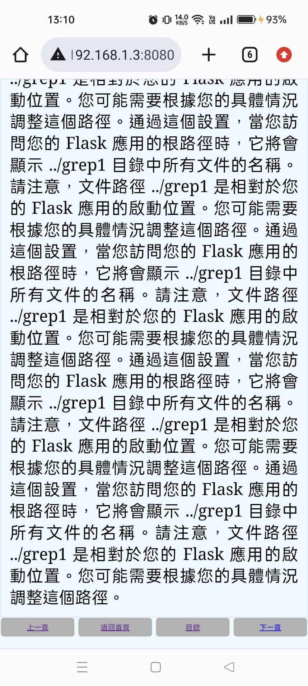
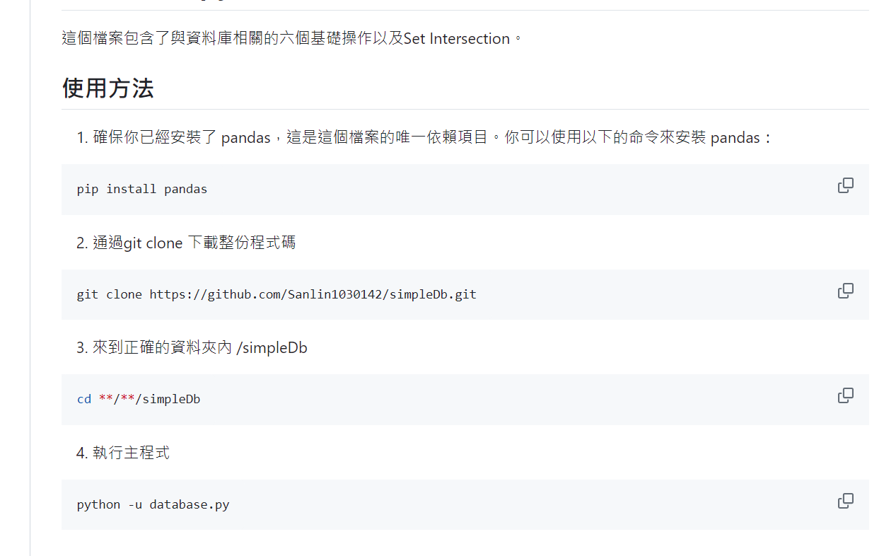

# personal-note
作品，筆記整理

## 1. 大學專題-災難救助遙測機器人

- 大三、大四專題製作的成果
- 獲得專題競賽(軟體與網頁組) 第一名
- 使用Linux為基底整合各項功能

## 2. wether report
- 嘗試取得官方的api來學習應用
- 取得天氣預報，並且使用github pages, action來做到自動化更新以及呈現
- 運用git知識做到自動整合與更新

## 3. flip coin

- 為了解決二選一難題所建立
- 基於HTML, CSS, JS的翻硬幣網站
- 實現手機自適應
- 透過github pages將網頁公開

## 4. web viewer

- 模仿市面小說網站所建立
- 基於flask的網頁設計
- 熟悉api, 網頁基礎

# 筆記作業區
## 1. simpleDb

- 以python的方式模仿資料庫系統行為
- 熟悉資料庫系統語言並嘗試理解其內容
- 清楚了解github操作並且熟練使用