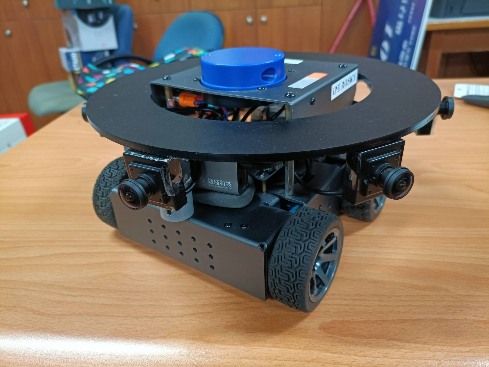
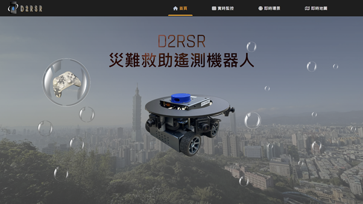
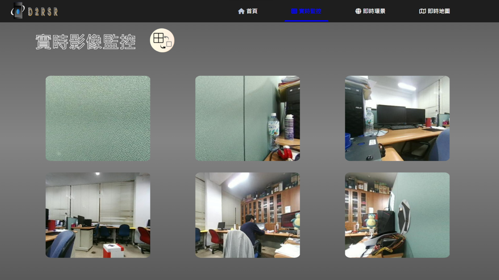
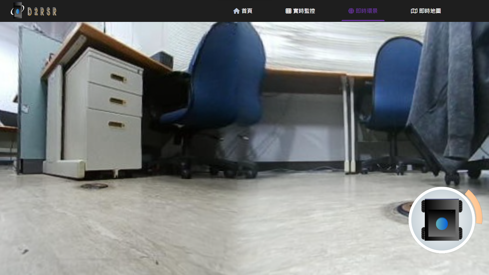
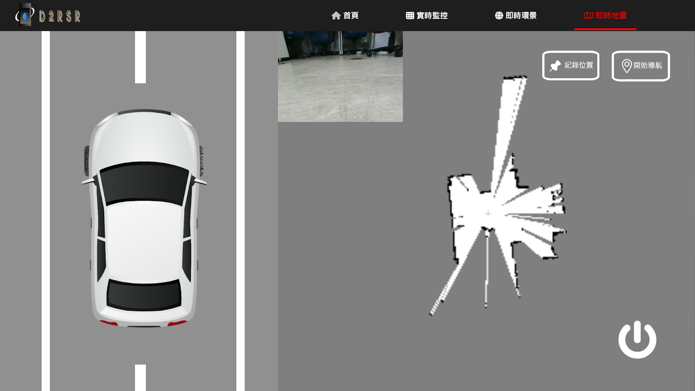
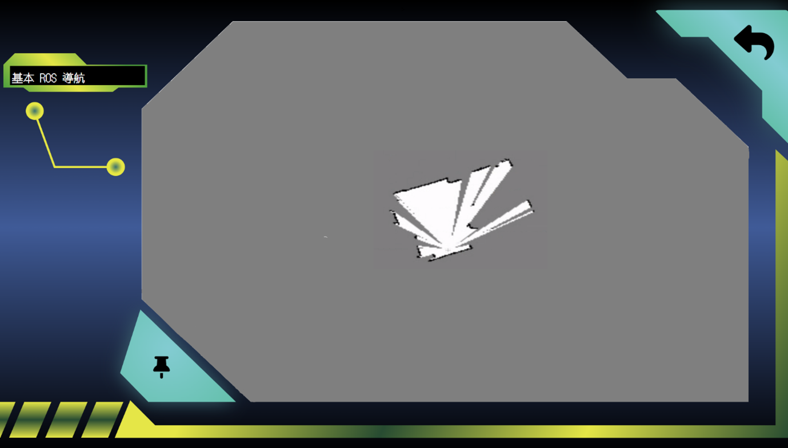

## 摘要
- D2RSR 為一個以自走車為主體的機器人系統
- 通過自走車、雷達、攝影機獲得顯現場資訊，透過系統整合到網頁呈現
- 為車用系統的一個原型機發想以及實驗結果

## 功能
1. 系統網頁介面
    - 為了整合以下所有功能，實作了一個網頁介面整合所有功能
    - 上方導航選單可以切換功能頁面

2. 單點監控功能
    - 將機體上的魚眼攝影機畫面校正(張正友標定法)
    - 並傳送到網頁上呈現

3. 環景影像功能
    - 透過加裝的六台攝影機畫面進行影像融合
    - 將現實的畫面實時的呈現在網頁上

4. 地圖繪製及導航功能
    - 透過自走車上的雷達來獲得現場資訊
    - 並將資訊擷取到自製網頁上呈現
    - 並能透過網頁反向控制車體進行導航

- 上圖左為障礙物的可視化效果，上面是前置攝影機畫面

